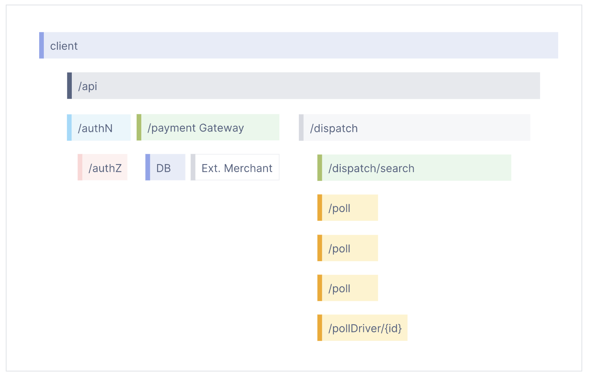
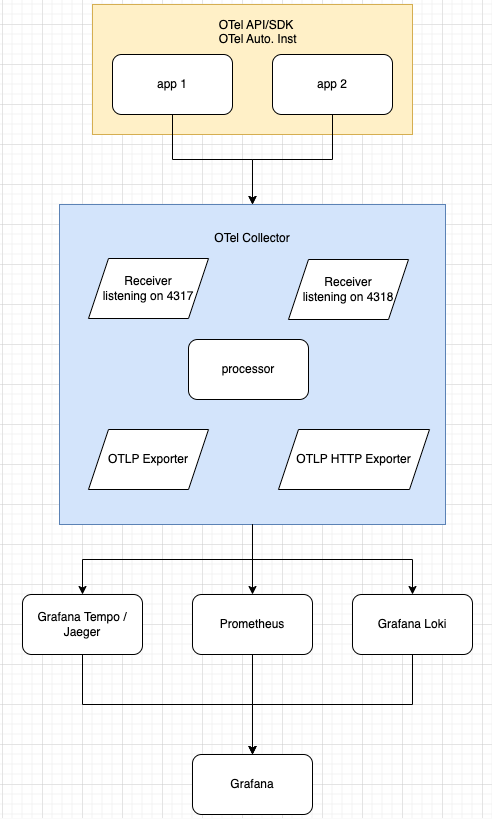
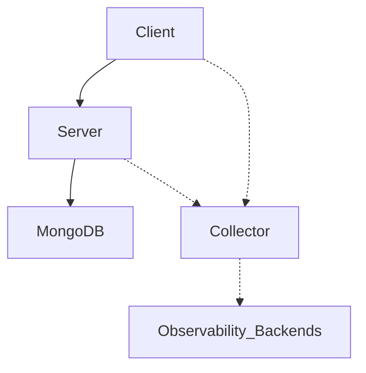
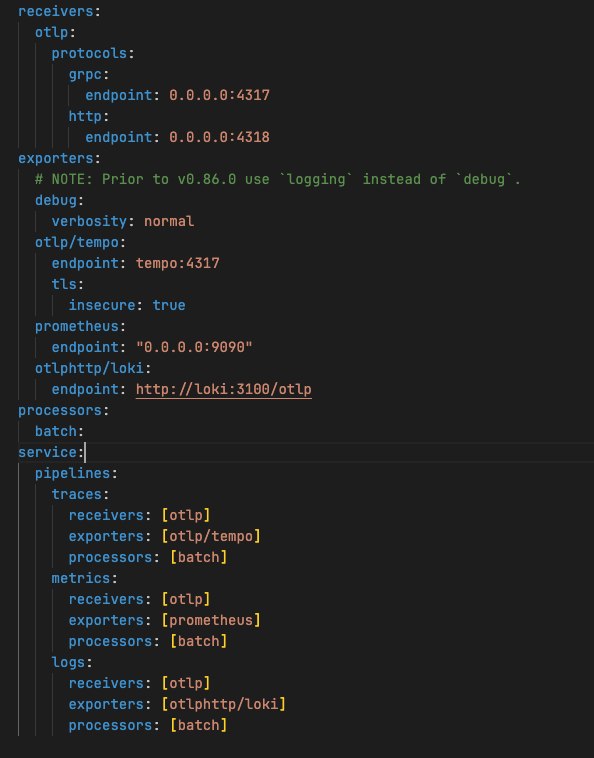

# OpenTelemetry
## Catch up
### Observability Data
1. Log :
    * Logs are timestamped records generated by an application during execution.
    * Logs can contain rich information, such as exceptions, request details, warnings, etc.
2. Metrics
    * Metrics are typically used to monitor resource usage and performance indicators like CPU usage, memory consumption, request count, and latency.
3. Trace
    * Represents the entire execution process of an operation within a system, especially across service calls in distributed systems.
    * Each trace is a collection of spans, where each span represents a single operation.

### Span
* Each Trace consists of multiple spans, with each span representing a specific step in the process.
* The root span of a trace represents the entry point of a request.


* A span include the following information:
    * Name
        * GET /orders/users/{user_id} http send
    * Parent span ID
    * Start and end timestamps
    * Span Context (trace_id, span_id, trace_flag, trace_state)
    * Attribute
        * user_id
        * database query string
    * Event
        * If the timestamp in which the operation completes is meaningful or relevant
    * Links
        * Link can associate one span with one or more spans
    * Status


## What is OpenTelemetry
* An Observability framework designed to create and manage telemetry data such as **traces**, **metrics**, and **logs**.
* Vendor agnostic & tool agnostic, e.g. jaeger, prometheus.
* It can be used with other observabiblity backends, e.g. jaeger, prometheus, tempo, loki....
* Focused on the generation, collection, management, and export of telemetry.



## Why use Opentelemetry
* You own the data that you generate. There’s no vendor lock-in.
* You only have to learn a single set of APIs and conventions.

## How to use OpenTelemetry
### Demo service structure

### Zero code
* As ops you might want to add observability to one or more applications without having to edit the source.
* It is supported for the language listed below
    * Go
    * .Net
    * PHP
    * Python
    * Java
    * JavaScript

#### Set up
install package
```bash
pip install opentelemetry-distro 
pip install opentelemetry-exporter-otlp
opentelemetry-bootstrap -a install
```

* `opentelemetry-distro`: include API, SDK, and the opentelemetry-bootstrap and opentelemetry-instrument tools.  
* `opentelemetry-exporter-otlp`: transmit data collected by OpenTelemetry to backend services or platforms using the OTLP protocol.  
* `opentelemetry-bootstrap -a install`: installs the corresponding instrumentation libraries for the packages installed in your site-packages folder. e.g. opentelemetry-instrumentation-fastapi

#### Start server
```bash
OTEL_PYTHON_LOGGING_AUTO_INSTRUMENTATION_ENABLED=true \
    opentelemetry-instrument \ 
    --traces_exporter otlp \
    --metrics_exporter otlp \
    --logs_exporter otlp \
    --service_name client \
    uvicorn app.main:app --host 0.0.0.0 --port 80
``` 
* `OTEL_PYTHON_LOGGING_AUTO_INSTRUMENTATION_ENABLED`: OpenTelemetry automatically adds trace information to Python logs without any manual code changes.
* `opentelemetry-instrument`: This is the command-line tool for starting OpenTelemetry.
* `{signal}_exporter`: Export trace, metric, and log data to an OTLP-compatible receiver.
* `--service_name client`: Sets the service name.

#### Start Collector
1. create otel-collector-config.yaml


2. create docker-compose.yaml
```yaml
version: '3.1'

services:
  otel-collector:
    image: otel/opentelemetry-collector:latest
    command: [ "--config=/etc/otel-collector.yaml" ]
    volumes:
      - ./otel-collector-config.yaml:/etc/otel-collector.yaml
    ports:
      - "4317:4317"
      - "4318:4318"
```

3. start collector
`docker-compose up -d`


### Code based


### k8s operator